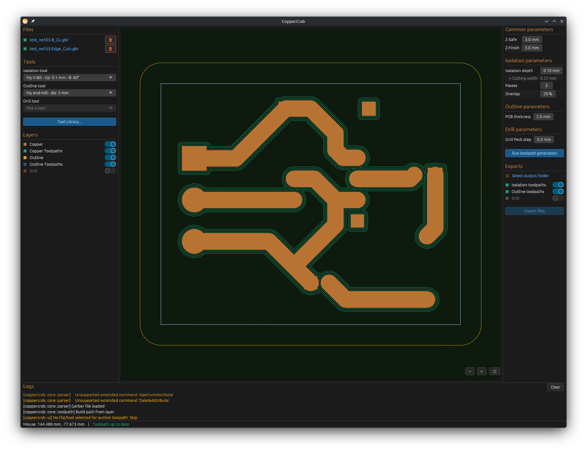

# 🦀 CopperCrab


> **PCB CAM software for CNC isolation routing, written in Rust.**

CopperCrab is a desktop application that takes Gerber and Excellon files as input and generates G-code for CNC machining of PCBs. It handles isolation routing (copper traces), board outline cutting, and drill operations — with a persistent tool library and a real-time PCB preview.



---

## Features

- Import Gerber files (copper top, board outline)
- Real-time 2D PCB preview with zoom and pan
- Persistent tool library (V-Bits, End Mills, Drill Bits) stored as TOML
- Isolation routing toolpath generation with configurable passes and overlap
- Outline toolpath generation
- G-code export (GRBL dialect)
- Multi-pass Z depth support based on tool `max_depth`
- Integrated log panel

---

## Roadmap / TODO

- [ ] **Inch support** — Gerber files in imperial units are parsed but not yet fully handled
- [ ] **Excellon / drill file support** — drill file parsing and G83 peck drilling G-code generation
- [ ] **i18n / translation files** — UI strings are hardcoded in English, `rust-i18n` integration planned
- [ ] **LinuxCNC and Mach3 G-code dialects** — currently only GRBL is supported
- [x] **App config persistence** — window size and last used folder  not yet saved between sessions
- [ ] **Unit tests** — parser and toolpath generator need proper test coverage
- [x] **CI/CD pipeline** — no automated build or test workflow yet
- [ ] **Nice icons** - display nice icon on linux (Is windows/mac ok ?)
- [ ] **Move to (0, 0)** - Move the traces to place the bottom-left PCB vertex to (0, 0).

---

## Dependencies

| Crate                                                                                       | Purpose                                                         |
| ------------------------------------------------------------------------------------------- | --------------------------------------------------------------- |
| [`eframe`](https://crates.io/crates/eframe) / [`egui`](https://crates.io/crates/egui)       | Native desktop GUI framework                                    |
| [`egui_extras`](https://crates.io/crates/egui_extras)                                       | Image loading support for egui                                  |
| [`clipper2`](https://crates.io/crates/clipper2)                                             | Polygon boolean operations and offsetting (toolpath generation) |
| [`lyon`](https://crates.io/crates/lyon)                                                     | Polygon tessellation for concave shape rendering                |
| [`gerber_parser`](https://crates.io/crates/gerber_parser)                                   | Gerber RS-274X file parsing                                     |
| [`rfd`](https://crates.io/crates/rfd)                                                       | Native file dialog (open/save)                                  |
| [`serde`](https://crates.io/crates/serde) + [`toml`](https://crates.io/crates/toml)         | Tool library and config serialization                           |
| [`log`](https://crates.io/crates/log) + [`env_logger`](https://crates.io/crates/env_logger) | Logging facade and console output                               |
| [`image`](https://crates.io/crates/image)                                                   | PNG image loading                                               |
| [`directories`](https://crates.io/crates/directories)                                       | Platform-appropriate config/data directories                    |

---

## Known Limitations

CopperCrab is functional but still in early development. The following limitations are known and some are planned to be addressed in future versions.

### Gerber parsing

- **Arc primitives** — arcs are parsed and converted to polygons via point approximation. Very tight arcs with few segments may show slight deviation from the original geometry.
- **Aperture macros** — complex aperture macros (`%AMOC8*%` and similar) are not fully supported. Most standard KiCad/Eagle exports work fine, but exotic macros may produce incorrect geometry.
- **Negative polarity** (`%LPD*%` / `%LPC*%`) — layer polarity switching (used for cutouts in copper pours) is not handled. Gerber files using `%LPC*%` (clear polarity) will render and machine incorrectly.
- **Step and repeat** (`%SR*%`) — panelized boards using the step-and-repeat block are not supported.

### Units

- **Inch Gerber files** — files declared as `%MOIN*%` are parsed but the unit conversion to mm has not been fully validated. Results may be incorrect for inch-unit boards.

### Toolpath generation

- **Bottom copper layer** — only the top copper layer is supported. Two-sided PCBs require flipping the board manually and generating a second pass.
- **Copper pours / filled zones** — large filled copper areas generate a very high number of polygons and may be slow to process or render.
- **Toolpath ordering** — paths are not optimized for travel distance. The CNC may make unnecessary long rapid moves between cuts. A nearest-neighbor sort is planned.
- **No DRC** — there is no design rule check. If your isolation depth is too shallow or your tool too wide, CopperCrab will not warn you that traces may be shorted.

### G-code

- **GRBL only** — only the GRBL dialect is currently exported. LinuxCNC and Mach3 support is planned.
- **No spindle ramp-up** — the spindle is started (`M3`) and the tool immediately moves to the first cut position. Some machines benefit from a short dwell (`G4`) after spindle start.
- **No tool change** — isolation, outline, and drill G-code are exported as separate files. Multi-tool workflows with automatic tool changers are not supported.

### Platform

- **Wayland icon** — the application icon does not display correctly on KDE Wayland. A `.desktop` file with the icon path is required as a workaround.
- **macOS notarization** — the macOS binary is unsigned. Gatekeeper will show a security warning on first launch. Right-click → Open to bypass it.

---

## Building from Source

### Prerequisites

- [Rust](https://rustup.rs/) (edition 2024, stable toolchain)
- A C/C++ compiler (required by `clipper2` FFI) — `gcc` or `clang`
- On Linux: `libgtk-3-dev` and `libxdo-dev` for native file dialogs

```bash
# Arch Linux
sudo pacman -S gcc gtk3 xdotool

# Ubuntu/Debian
sudo apt install build-essential libgtk-3-dev libxdo-dev
```

### Build and run

```bash
git clone https://github.com/jnthbdn/CopperCrab.git
cd CopperCrab
cargo run --release
```

The release build is significantly faster for rendering large PCBs. Use `cargo run` (debug) during development for faster compile times.

### Log level

```bash
RUST_LOG=debug cargo run
RUST_LOG=coppercrab=debug cargo run   # only CopperCrab logs
```

---

## Usage

### Basic workflow

1. **Import files** — click the copper Gerber file link in the left panel, then optionally the outline Gerber
2. **Select tools** — pick an isolation tool (V-Bit or End Mill) and an outline tool from the dropdowns
3. **Adjust parameters** — set depth, number of passes, overlap, Z-safe, and Z-finish in the right panel
4. **Generate toolpaths** — click "Run toolpath generation"; toolpaths appear as colored overlays on the canvas
5. **Select output folder** — click the output folder link in the Export section
6. **Export** — toggle which files to export and click "Export files"

### Tool library

Click **Tool Library...** in the left panel to open the tool manager. You can add, edit, and delete V-Bits, End Mills, and Drill Bits. The library is automatically saved to a `tools.toml` file in your platform config directory.

### Canvas navigation

- **Pan** — click and drag
- **Zoom** — scroll wheel (zooms toward the cursor)
- **Layer visibility** — toggle layers in the left panel using the eye buttons

---

## Contributing

Contributions are welcome — bug reports, feature requests, and pull requests alike.

### Getting started

1. Fork the repository
2. Create a branch: `git checkout -b feat/my-feature`
3. Make your changes, keeping the KISS principle in mind — the `core` crate must stay UI-independent
4. Open a pull request with a clear description of what changed and why

### Architecture overview

```
src/
├── core/           # Business logic — no UI dependencies
│   ├── geometry/   # Primitive types (Segment, Arc, Circle, Rectangle)
│   ├── parser/     # Gerber → PcbLayer conversion
│   ├── toolpath/   # Clipper2-based toolpath generation + G-code export
│   └── tools/      # CncTool trait, VBit / EndMill / DrillBit, ToolLibrary
└── ui/             # egui frontend — only depends on core
```

The `core` crate exposes no egui types. If you are adding a new feature, implement the logic in `core` first with no UI, then wire it up in `ui`.

### Code style

- Standard `rustfmt` formatting (`cargo fmt`)
- Log with the `log` facade (`log::info!`, `log::warn!`, etc.) — never `println!`
- English for all code, comments, and log messages

---

## License

MIT — see [LICENSE](LICENSE) for details.